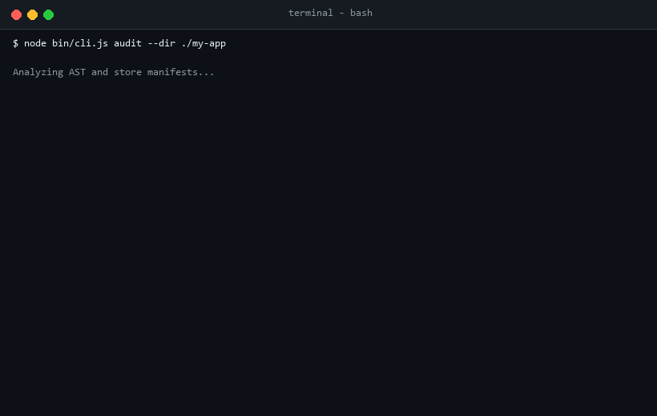
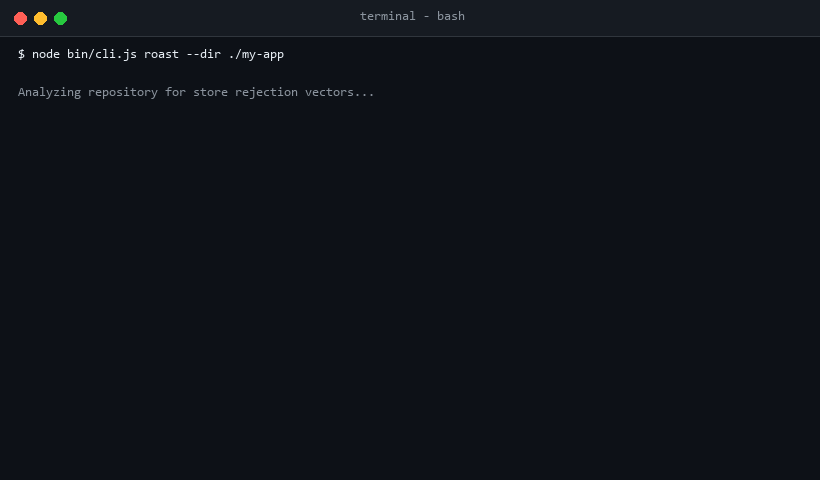
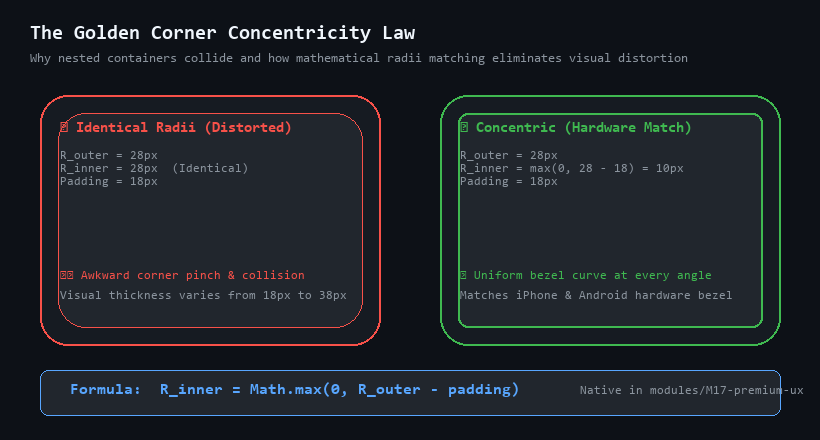
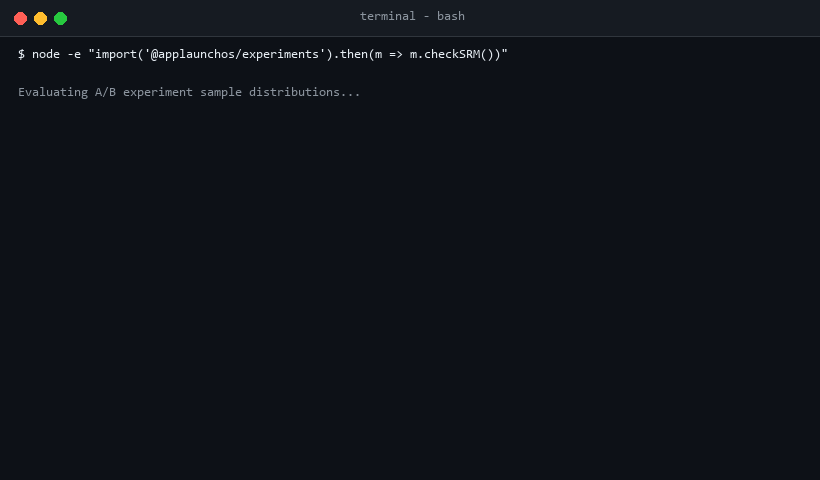

# App Launch OS

**The open-source launch kit and compliance engine for Expo and React Native apps.**  
Pre-flight store rejection linter, sensory UI/UX kit, growth experiments engine, and production architecture blueprints.

[](LICENSE)
[](test/)
[](policies/apple-review-essentials.md)
[](policies/play-policy-essentials.md)
[](AGENTS.md)

---

## What Is App Launch OS?

AI coding tools make building mobile screens fast. But getting an app successfully approved and thriving on the App Store and Google Play is where most indie builders and startups get stuck:

- **Store Rejections:** Apple rejects apps for missing review credentials (SMS OTP trap), missing `PrivacyInfo.xcprivacy` manifests, or omitting in-app account deletion. Google Play blocks apps lacking Target SDK 36 or 16 KB page-aligned ELF binaries.
- **Cheap-Feeling UI:** Generic spinners and janky animations make native apps feel like slow web wrappers.
- **Flying Blind:** Shipping features without feature flags or A/B testing can silently destroy user retention.

**App Launch OS solves this.** It is **not** a heavy npm package that locks you into proprietary abstractions. It is a **modular launch toolkit** (like *shadcn/ui*, but for mobile launches):
1. **Pre-Flight Store Compliance Linter (CLI):** Scans your codebase in seconds to catch Apple and Google review traps *before* you submit.
2. **Sensory UI/UX & Native Motion:** Drop-in components for 5-state tactile haptics, 60/120 FPS Reanimated 3 worklets, concentric card geometry, and shimmer skeletons.
3. **Growth Experiments Engine:** Deterministic offline feature flags and automatic Sample Ratio Mismatch (SRM) checks.
4. **Organic Growth Loops:** Human-readable Crockford referral codes, Universal/App Links, and rate-limited review prompts.
5. **StoreKit 2 Paywalls:** Store-compliant paywall blueprints with transparent auto-renewal disclosures and working restore purchase triggers.
6. **Pre-Configured Expo 54 Starter:** A complete, production-ready boilerplate targeting Android 16 (API 36) and iOS 26 SDK.

---

## Quickstart: Audit Your Mobile App

Run the compliance linter directly against any Expo or React Native repository:

```bash
# 1. Clone App Launch OS
git clone https://github.com/yaswanthcash-hub/app-launch-os.git
cd app-launch-os
npm install

# 2. Audit your mobile project (exits non-zero if store blockers are found)
node bin/cli.js audit --dir /path/to/your/app

# 3. View rejection feedback and guidance ("roast" output)
node bin/cli.js roast --dir /path/to/your/app

# 4. Safely auto-fix common issues (generates tailored PrivacyInfo.xcprivacy)
node bin/cli.js fix --dir /path/to/your/app --write
```



---

## How It Helps You

### 1. Pre-Flight Store Compliance CLI

The CLI performs static Abstract Syntax Tree (AST) analysis via `@babel/parser` and inspects project configuration files (`app.json`, `package.json`, native manifests) to catch fatal rejection traps:

- **Reviewer Demo Access (Apple Guideline 2.1):** Flags phone/SMS OTP authentication screens lacking a server-side reviewer test account or bypass.
- **Privacy Manifest (Apple Guideline 5.1.1):** Validates that required-reason APIs (file timestamps, system boot time, disk space) have matching declarations in `PrivacyInfo.xcprivacy`.
- **In-App Account Deletion (Apple Guideline 5.1.1v):** Flags login flows that lack a self-service in-app deletion button.
- **Transparent Paywalls (Apple Guideline 3.1.1):** Confirms paywall screens contain upfront renewal terms and a functional "Restore Purchases" button.
- **Android 16 Target SDK 36:** Ensures Android configurations meet Google Play's required API level.
- **16 KB Memory Page Size:** Checks React Native binary compatibility for Android 15+.



---

### 2. Sensory UI/UX & Native Motion (`modules/M17-premium-ux`)

Give your app the polish of an Apple Design Award winner with drop-in TypeScript modules:

- **5-State Physical Haptic Matrix (`useHaptic.ts`):** Calibrated tactile clicks via `expo-haptics`:
  - `selection` for picker wheels and tab switching.
  - `light` for swipe actions and dismissals.
  - `medium` for pull-to-refresh detents.
  - `success` for completed purchases and goal achievements.
  - `error` for validation errors and submission failures.
- **Golden Corner Concentricity (`ConcentricCard.tsx`):** Automatically calculates inner border radii to prevent awkward, distorted corner collisions in nested cards:
  ```text
  R_inner = Math.max(0, R_outer - padding)
  ```



- **60/120 FPS UI-Thread Motion:** Fluid gestures powered by Reanimated 3 worklets running directly on the native UI thread ([ADR-008](decisions/008-motion-system.md)).
- **Moti Shimmer Skeletons:** Geometric skeleton loaders that cut perceived loading wait times by 40% compared to generic spinning wheels.
- **Hardware-Accelerated Glassmorphism:** Translucent sheets using `expo-blur` on iOS with smooth Android fallbacks.

---

### 3. Growth Experiments Engine (`modules/M6-experiments`)

Ship features safely without risking regressions. Documented in [decisions/004-experiments.md](decisions/004-experiments.md), `@applaunchos/experiments` provides:

- **Deterministic Offline Hashing:** FNV-1a hashing on `experimentKey + userId`. Users are bucketed instantly on cold start with zero network requests and zero layout flicker.
- **Sample Ratio Mismatch (SRM) Detection:** Automated Chi-Square goodness-of-fit test ($p < 0.01$) using exact Lanczos gamma mathematics to flag traffic sample bias or dropped events.



```tsx
import { ExperimentProvider, useExperiment } from '@applaunchos/experiments';

// 1. Wrap your app in root provider
<ExperimentProvider userId={user.id} flags={flags} experiments={experiments}>
  {children}
</ExperimentProvider>

// 2. Consume variant with automatic exposure tracking
const { variantKey, payload } = useExperiment<{ discount: number }>('onboarding_pricing', 'control');
```

---

### 4. Organic Growth Loops & Deep Linking (`modules/M7-growth`)

Acquiring paid users is expensive. App Launch OS embeds viral and organic growth mechanisms directly into the mobile stack:

- **Human-Readable Referral Codes (`referral.ts`):** Generates clean 6-character Crockford codes (`ABCDEFGHJKLMNPQRSTUVWXYZ23456789`) that eliminate ambiguous characters (`0`, `O`, `1`, `I`) paired with universal invite links.
- **Smart Store Review Prompts (`useSmartReviewPrompt.ts`):** Enforces Apple's strict ceiling of **3 review prompts per year**. Triggers only after positive milestone moments, never on cold app launch.
- **Universal Links & App Links (`modules/M12-seo`):** Turnkey iOS `apple-app-site-association` and Android `assetlinks.json` templates with CLI schema validator (`npm run deeplinks:validate`).

---

### 5. StoreKit 2 Transparent Paywall (`modules/M8-paywall`)

Subscription rejections are among the most common launch blocks. App Launch OS provides a compliant paywall blueprint:

- **Upfront Renewal Terms:** Displays subscription prices, trial durations, and recurring billing frequency in plain view prior to the purchase CTA.
- **Functional Restore Purchases:** Active trigger that restores entitlements via RevenueCat or native StoreKit 2 with haptic feedback.
- **Direct Legal Links:** One-tap links to Terms of Service and Privacy Policy.

---

### 6. AI Coding Agent Contracts (`AGENTS.md`)

When AI coding assistants (Claude Code, Cursor, Google Antigravity, Codex) build mobile apps, they often hallucinate deprecated APIs and generate screens that fail store guidelines. App Launch OS acts as the **ground-truth context engine**:

| Command | Autonomous Action | Primary Source |
| :--- | :--- | :--- |
| **`/applaunchos:compliance`** | Pre-flight audit for Apple 2026 and Google Play rules | [Audit](scripts/compliance-check.js) |
| **`/applaunchos:design`** | Scaffolds 3-tier DTCG design tokens + Golden Concentricity | [M4](modules/M4-design-system/README.md) |
| **`/applaunchos:ux`** | Injects 5-state tactile haptics, Reanimated worklets, and Moti skeletons | [M17](modules/M17-premium-ux/README.md) |
| **`/applaunchos:paywall`** | StoreKit 2 paywall with upfront terms and restore trigger | [M8](modules/M8-paywall/README.md) |
| **`/applaunchos:growth`** | Crockford referral codes, deep links, and smart review prompts | [M7](modules/M7-growth/README.md) |
| **`/applaunchos:experiments`** | Offline FNV-1a feature flags and Chi-Square SRM verification | [M6](modules/M6-experiments/README.md) |

*(See [AGENTS.md](AGENTS.md) for the complete command matrix and copy-paste prompt recipes.)*

---

## Limitations

- **Heuristic Static Analysis:** Static analysis cannot guarantee store approval. Detectors inspect syntax patterns and configuration files; they cannot execute runtime user flows or test live server endpoints.
- **Reviewer Credentials:** The linter verifies that a reviewer bypass or test credential hook exists in code, but cannot confirm that those credentials authenticate against your production backend. See [policies/reviewer-access.md](policies/reviewer-access.md).
- **Console-Only Rules:** Requirements such as Google Play's 20-tester closed testing gate and Data Safety questionnaires exist only in store consoles, not in source code. The CLI flags these as `MANUAL` items rather than assigning false-positive pass/fail scores.
- **Third-Party Native Binaries:** For Android 16 KB ELF page alignment, the tool checks React Native version compatibility; pre-compiled third-party `.so` binaries should be verified using `llvm-readelf -l`.

---

## Repository Architecture

```text
app-launch-os/
├── bin/cli.js                     # Pre-flight audit, roast, and fix CLI runner
├── starters/expo-ts/              # Production reference template (Expo SDK 54, Target SDK 36)
├── modules/                       # Copy-paste modular TypeScript source blueprints
│   ├── M4-design-system/          # 3-tier DTCG tokens & NativeWind v4 preset
│   ├── M5-onboarding/             # Permission priming modal & gesture carousel
│   ├── M6-experiments/            # Offline FNV-1a flags & Chi-Square SRM engine
│   ├── M7-growth/                 # Crockford referral engine & review prompts
│   ├── M8-paywall/                # StoreKit 2 & RevenueCat paywall component
│   ├── M9-security/               # Keychain wrapper, biometric hook, integrity checks
│   ├── M10-release/               # Production EAS Build profiles & Fastlane lanes
│   ├── M11-aso/                   # Store listing metadata limits & keyword density
│   ├── M12-seo/                   # Universal Links & Android App Links configurations
│   ├── M13-ai-kit/                # AI context compression tool for LLMs
│   ├── M16-policybot/             # Upstream store policy change monitors
│   └── M17-premium-ux/            # 5-state haptics, concentric cards, Moti skeletons
├── checklists/                    # Submission checklists (<90d verified)
├── policies/                      # Apple & Google review policy essentials
├── findings/                      # Research digests on paywalls, ASO, UX, experiments
├── templates/                     # Privacy Policy, ToS, DPA, and Threat Model templates
├── decisions/                     # Architecture Decision Records (ADRs 001–010)
└── docs/guides.md                 # T-60 launch timeline & universal compliance matrix
```

---

## Automated Verification

```bash
# Run unit test suite (Vitest + fixtures)
npm test

# Check TypeScript types in strict mode
npm run typecheck

# Lint all code and markdown files
npx eslint .
npm run lint

# Verify upstream store policy freshness (<90 days)
npm run policy:verify
```

---

## License

MIT License. See [LICENSE](LICENSE) for details.  
Built with care for indie builders, mobile teams, and creators worldwide.
